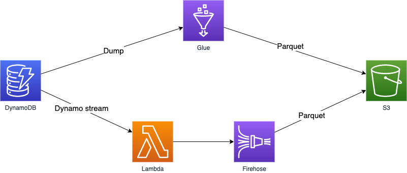
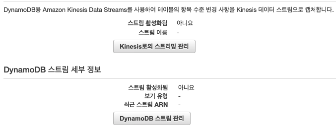
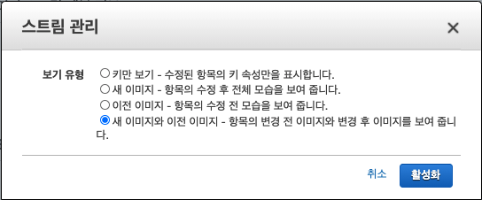
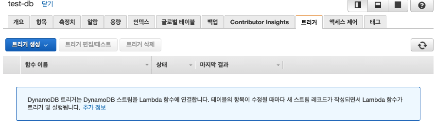
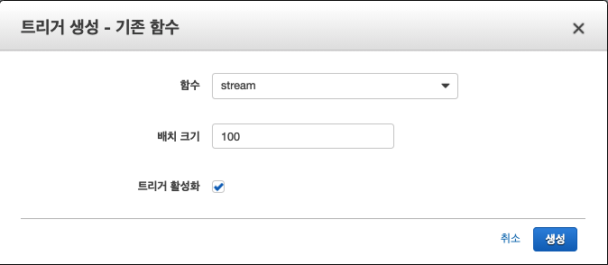

# dynamoDB_to_S3

## 구조

## DynomoDB 실시간 파이프 라인 구축

### 1. Dynamo Stream을 사용한 CDC 데이터 파이프라인

DynamoDB의 데이터를 실시간으로 S3로 보내는 파이프라인 작업이 필요하다.

1.1 DynamoDB의 DynamoDB 스트임을 활성화 시킨다. 

작성 시점에서 kinesis로의 스트리밍 관리가 서비스가 추가되었다... 작업시점에는 없었던 기능이다

 스트림 관리를 들어가면 아래와 같은 화면이 있다.

새로 등록된 데이터만 옮길 예정으로 "새 이미지"를 사용한다.

1.2 람다 데이터를 처리할 Firehose 생성

S3에 스트림데이터를 적재하기 위한 Firehose를 생성한다.

1.3 스트림 처리 람다함수 등록

/lambda/stream_lambda.py 를 람다에 등록시킨다.

1.4 DynamoDB 트리거 활성화

생성한 DynamoDB에서 트리거를 추가한다.

1.5 S3에 적재되는 데이터 확인

DynamoDB Stream의 배치크기와 Firehose의 배치 시간, 크기에 따라 최소 1분 ~ 15분 정도의 데이터 딜레이가 발생